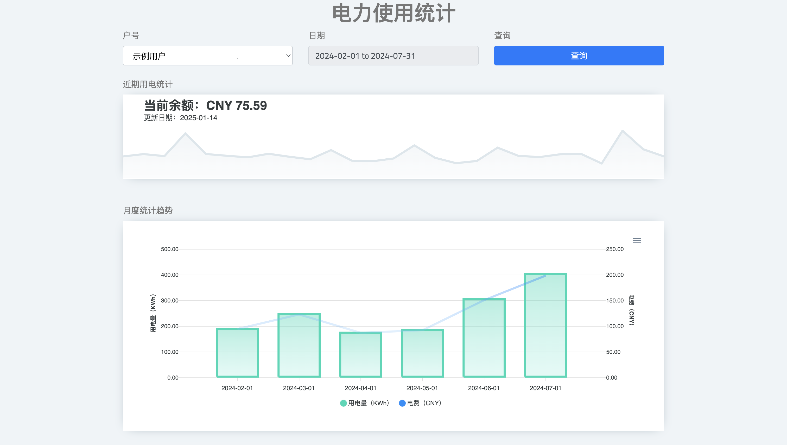
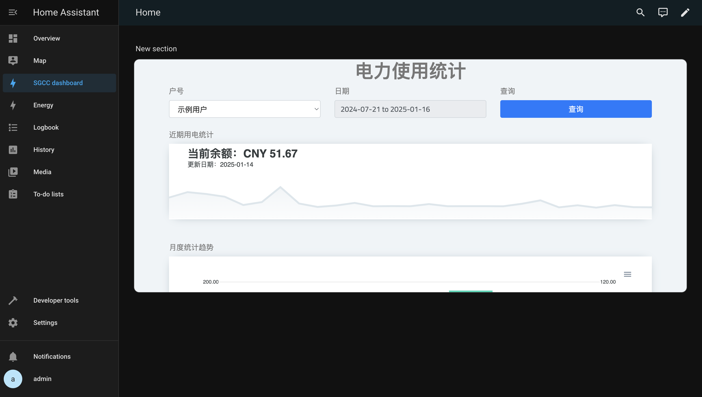
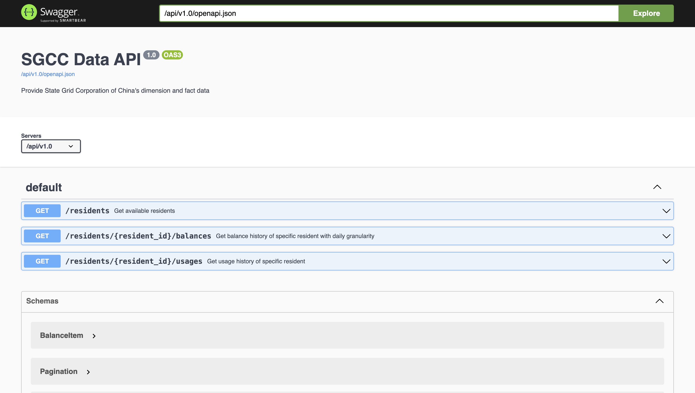

# sgcc-alert


[English](README.md) · [简体中文](README.zh.md)

Know your home power usage from `State Grid Corporation of China` (`SGCC`)

## Features

- Periodically collect power usage and charge data
- Provide residents and their usage data through Web API
- Web page which illustrates BI dashboard

## Quick Start
Pull the codes to your local environment
```bash
$ git clone https://github.com/usharerose/sgcc-alert.git && cd sgcc-alert
```

Rename `./settings_local.py.template` to `./settings_local.py`, and fill your personal settings into it.

```python
SGCC_ACCOUNT_USERNAME = 'admin'  # account name of SGCC official website
SGCC_ACCOUNT_PASSWORD = 'admin'  # account password of SGCC official website


DAILY_CRON_TIME = '06:00'  # The time when fetch your usage data from remote, MM:SS


SYNC_INITIALIZED = True  # Whether fetch your usage data immediately when start services or not
```

Then start the services
```bash
$ make run
```

You can view the illustration by http://127.0.0.1:30001/dashboard



And integrate with other unified center. e.g. Home Assistant as Webpage card.



## API

Service exposes APIs, allowing users to query data. You can view the definitions from http://127.0.0.1:30001/api/v1.0/docs/.



## Development

### Environment

#### Docker (Recommended)
Execute the following commands, which sets up a service with development dependencies and enter into it.
```shell
> make run && make ssh
```

#### Virtual Environment
1. As a precondition, please [install Poetry](https://python-poetry.org/docs/1.7/#installation) which is a tool for dependency management and packaging in Python.
2. Install and activate local virtual environment
    ```shell
    > poetry install && poetry shell
    ```
3. `IPython` is provided as interactive shell
