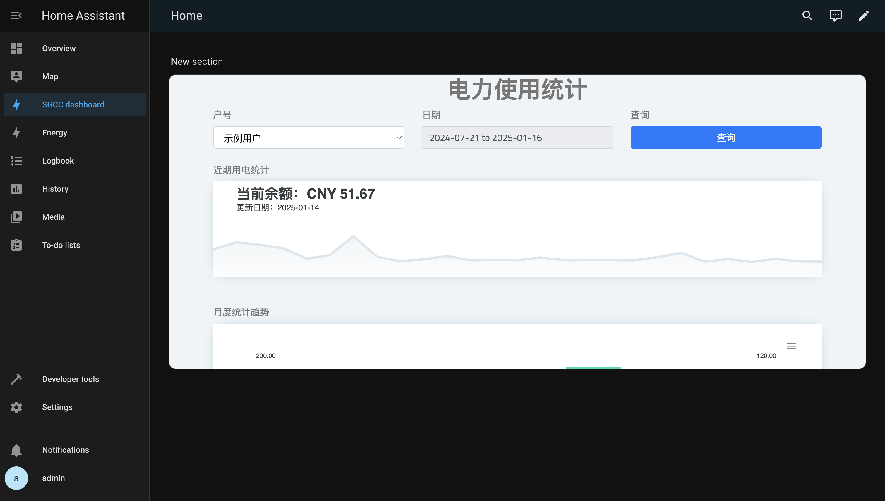
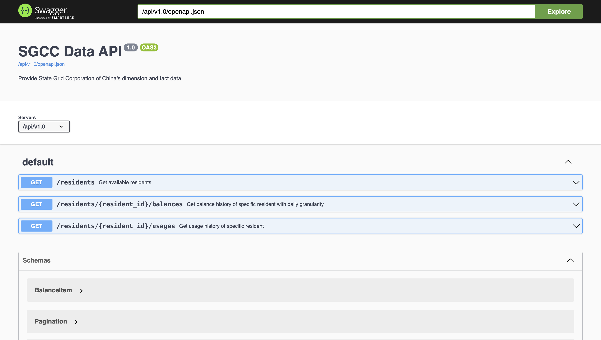

# sgcc-alert


[English](README.md) · [简体中文](README.zh.md)

掌握你家的电力使用情况，支持国家电网

## 功能

- 定期收集电力使用和充电数据
- 通过 Web API 为居民提供数据访问服务
- 提供一个展示 BI 仪表盘

## 快速开始
将代码库拉取到本地
```bash
$ git clone https://github.com/usharerose/sgcc-alert.git && cd sgcc-alert
```

将`./settings_local.py.template`重命名为`./settings_local.py`，并设置相关参数

```python
SGCC_ACCOUNT_USERNAME = 'admin'  # 国家电网账号用户名
SGCC_ACCOUNT_PASSWORD = 'admin'  # 国家电网账号密码


DAILY_CRON_TIME = '06:00'  # 每日数据同步定时任务启动时间, 格式为MM:SS


SYNC_INITIALIZED = True  # 是否在首次启动服务时，立即执行一次数据同步任务e
```

接着，启动服务
```bash
$ make run
```

访问 http://127.0.0.1:30001/dashboard ，可浏览仪表盘页面


该页面可集成至其他中枢管理平台。例如在Home Assistant中，以`Webpage`类型卡片，集成至仪表盘中



## API

服务暴露一组Web API提供数据查询服务，可以通过 http://127.0.0.1:30001/api/v1.0/docs/ 浏览接口定义



## 开发

### 环境

#### Docker (推荐)
可执行下列命令，启动服务并登入容器环境
```shell
> make run && make ssh
```

#### 虚拟环境
1. 首先，请[安装Poetry](https://python-poetry.org/docs/1.7/#installation)，本项目将其作为Python依赖管理工具
2. 执行以下命令，安装依赖并激活本地虚拟环境
    ```shell
    > poetry install && poetry shell
    ```
3. 可使用`IPython`作为Python命令行交互工具进行调试
